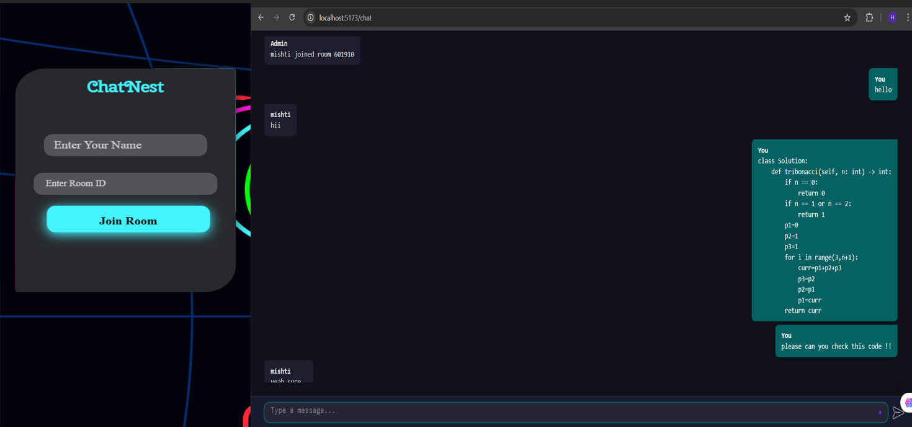

# ChatNest

ChatNest is a real-time messaging & Code Sharing web application built using the MERN stack and Socket.IO. It enables users to create chat rooms, exchange text messages, and share code snippets and files (up to 2MB) seamlessly, just like popular messaging apps. A button for future collaborative code editing has also been included for upcoming features.

## 🌐 Live Deployment

- **Frontend (Vercel):** https://chat-nest-nine.vercel.app/
- **Backend (Render):** https://chatnest-1i5j.onrender.com
- **Source Code (GitHub):** https://github.com/gkjaiswal09/ChatNest

---

## Project ScreenShot




## Features

🔹 **Real-time individual and group chat** (up to 100 users)  
🔹 **Typing indicators** for active users  
🔹 **Upload and share code snippets** or text (simple paste like WhatsApp)  
🔹 **Upload and share files** (up to 2MB per file)  
🔹 **Create or join chat rooms** with unique Room IDs  
🔹 **Separate collaborative code editor window** (Coming Soon 🚀)

## Tech Stack

- **Frontend**: React.js (built with Vite)
- **Backend**: Node.js, Express.js
- **Real-Time Communication**: Socket.IO
- **Database**: MongoDB (using Mongoose)
- **File Uploads**: Multer
- **Session Management**: express-session

## 🚀 How to Run ChatNest

### What You Need

- **Node.js** installed ([Download here](https://nodejs.org/))

---

## 📋 STEP-BY-STEP SETUP (First Time Only)

### Step 1: Get the Code

```bash
git clone https://github.com/gkjaiswal09/ChatNest.git
cd ChatNest
```

### Step 2: Install Frontend Files

```bash
npm install
```

### Step 3: Install Backend Files

```bash
cd server
npm install
cd ..
```

✅ **Setup is complete!** You only do these 3 steps once.

---

## ▶️ HOW TO START THE APP (Every Time You Want to Run It)

**You need to open 2 different terminal windows** (keep both open while using the app)

### TERMINAL 1 - Start Backend Server

```bash
cd ChatNest
cd server
node index.js
```

✅ Wait until you see a message that the server is running

### TERMINAL 2 - Start Frontend

Open a NEW terminal window and run:

```bash
cd ChatNest
npm run dev
```

✅ Wait until you see `Local: http://localhost:5173/`

### TERMINAL 3 - Open in Browser

Open your web browser and go to:

```
http://localhost:5173/
```

🎉 **ChatNest is now running!** Start creating rooms and chatting!

---

## 📝 Summary

| Part     | Command                      | Port |
| -------- | ---------------------------- | ---- |
| Backend  | `cd server && node index.js` | 4500 |
| Frontend | `npm run dev`                | 5173 |
| Browser  | http://localhost:5173        | -    |

## Future Roadmap

✅ **Initial version** with real-time messaging and file sharing  
🔜 **Collaborative real-time code editor** (integrated with rooms)  
🔜 **Improved UI/UX enhancements**  
🔜 **Deployment** (Vercel/Render)

## 📌 Important

Built primarily for learning, showcasing, and portfolio demonstration purposes.  
Source code remains under active development and refinement.

## 📧 Contact

If you'd like to learn more, collaborate, or request access to the repository:  
Email: **2k22.cse.2211364@gmail.com**  
LinkedIn: **https://www.linkedin.com/in/ghanshyam-kumar-969364261/**
